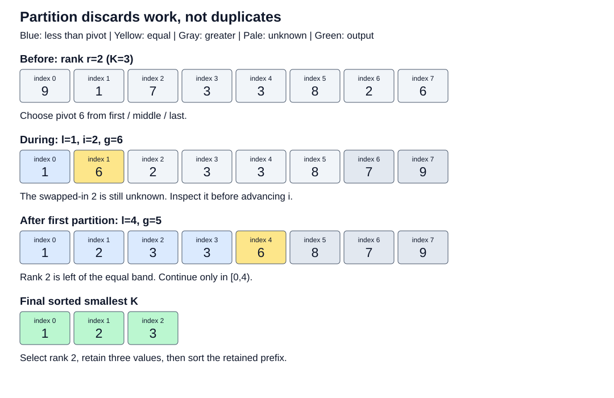

# Selection, Quickselect, and Top-K

Return the smallest K signed integers, sorted ascending with duplicates preserved,
from an immutable slice. K=0 returns an empty vector, K=N returns all sorted,
and K>N returns None. Rank is zero based: K=3 ends at rank 2.

The running input is `[9,1,7,3,3,8,2,6]`. Its sorted smallest three are `[1,2,3]`.
Partitioning finds the cutoff without ordering every discarded value.



The three-way invariant is `[lo,l) < pivot`, `[l,i) == pivot`,
`[i,g) unknown`, `[g,hi) > pivot`. A greater-than swap does not advance i:
the swapped-in value remains unknown. After pivot 6, rank 2 lies in the
four-element left partition. Pivot 3 finishes its equal band in the next pass.
The first two passes classify 8+4=12 values. Sort the retained prefix afterward.

Candidates:

- `full_sort`: full copied vector, adaptive unstable sort, truncate.
- `standard`: copied vector, select rank K-1, truncate, sort K outputs.
- `three_way`: median-of-three equal-band partitioning with an 8*N cumulative
  classification budget; sort the active slice when exhausted. Worst case
  O(N log N), unlike the library selector's linear bound.
- `heap`: build a K-element max-heap, replace its worst retained value only
  when a smaller value arrives, then convert to sorted output.
- `buffer`: sorted K-element buffer, reject against its last element;
  binary-search and shift only when a smaller value arrives.

For N inputs, K outputs, and R replacements after the initial K values:
full sort uses O(N log N) general work; library selection plus output sort uses
O(N + K log K); heap uses O(N + R log K + K log K); buffer uses
O(K log K + N + R*K) worst-case moves. For N=8,K=3,R=3, the models contain
24 full-sort comparison units, 8 selection units plus 4.75 prefix-sort units,
5 heap rejection checks plus 4.75 repair units and 4.75 output-sort units,
and at most 9 buffer moves. These are cost models, not measured counts.

Sort/selection wrappers copy N values and retain N allocation slots even after
truncation. Heap/buffer retain K values, but this experiment's input remains
resident. A stream changes input storage; do not call this benchmark O(K)
total process memory. For records use one total comparator with a stable ID
through selection, sorting, and merging. Define NaN behavior separately.

## Run

```bash
cargo test -p top-k-portfolio --all-targets
cargo run -p top-k-portfolio --example top_k
python3 topics/008-selection-quickselect-top-k/scripts/run.py --out /tmp/top-k-run
```

Use a new output directory. The example prints `[1, 2, 3]` for all candidates.
The runner needs Python 3, rustc, and on Linux `lscpu` and `objdump` (`sysctl`
and `otool` on macOS); it uses `taskset` when present.
The Cargo bench executable is a parameterized driver, not an automatic campaign;
use the Python runner for the fixed order and independent process schedule.

Read [BENCHMARK.md](BENCHMARK.md), [the results](measurements/README.md), and
[the correctness strategy](TEST_STRATEGY.md) before choosing a candidate.
Keep full sort for ordered or large-K input, library selection for resident
medium/large-K batches, and compare heap/buffer when K is small. The teaching
selector explains the invariant; it is not the recommended universal fastest path.

Primary sources: [Rust slice contract](https://doc.rust-lang.org/std/primitive.slice.html#method.select_nth_unstable),
[Rust 1.93.1 selector source](https://github.com/rust-lang/rust/blob/1.93.1/library/core/src/slice/sort/select.rs),
[Rust 1.98.0 slice source](https://github.com/rust-lang/rust/blob/1.98.0/library/core/src/slice/mod.rs),
[BinaryHeap contract](https://doc.rust-lang.org/std/collections/struct.BinaryHeap.html).
Implementation details are version-specific. Timing observations establish
neither candidate-only branch behavior nor cache causation.
