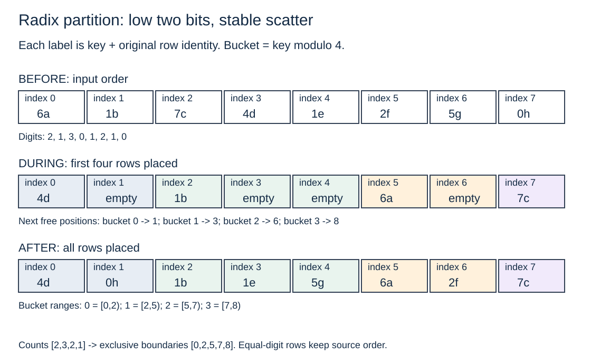

# Radix partitioning

Turn digit counts into exact output ranges. A partition groups records by selected bits;
it does not fully sort keys. The complete lesson was taught before this branch existed.

## Running example

For low two bits, input `6a 1b 7c 4d 1e 2f 5g 0h` has digits
`2 1 3 0 1 2 1 0`. Counts `[2,3,2,1]` give boundaries `[0,2,5,7,8]`.
After the first four records, output is `4d _ 1b _ _ 6a _ 7c`.
Stable final output is `4d 0h | 1b 1e 5g | 6a 2f | 7c`.
The letters identify source records. Bucket zero contains 4 before 0 because digit
partitioning preserves source order rather than sorting full keys.



## Contract and choices

`Digit::new(shift,bits)` accepts at most12 selected bits, shift below64, and no
crossing the key end. Zero bits gives one bucket. Keys are prehashed u64 values;
hashing is outside the lab. Rows carry unique identity and inline payload.
Every result owns all input records exactly once and returns B+1 exclusive boundaries,
including empty buckets. `buckets`, `scatter`, and `two_pass` preserve source order
within each bucket. `cycles` is unstable. Its immutable-input adapter includes cloning;
`cycles_in_place` accepts caller-owned mutable rows and uses O(B) auxiliary metadata.

Bucket vectors are a readable stable baseline with growth allocations and flattening.
Scatter counts, prefixes, initializes a safe output vector, and writes final positions.
Two-pass scatter groups the high half of the digit then subdivides each group by the low
half. High-first GLOBAL passes would give the wrong digit order; local refinement is
essential. The current two-pass API includes intermediate allocations/copies.
Cycles swap misplaced records into destination ranges and give up stability.

Counts h_b establish starts s_b=sum(q<b)h_q. Histogram scatter costs O(n+B),
output n*w bytes plus O(B) metadata. Here n8,B4,w16 gives128 output bytes, two
8-record scans and a four-count prefix. Safe initialization adds output writes.
Uniform consumer sizing n*t/B<=C is only an estimate: here t32 gives64 average
bytes per bucket, but the largest3-record bucket needs96 bytes. A heavy identical key
remains together regardless of extra bits. Local hash-table indexing must not rely only
on bits already fixed by partition membership.

Worker offsets O[b,t]=S[b]+sum(u<t)H[b,u] give disjoint writes. Ordered contiguous
input shards and stable local scans preserve global stability. Parallel execution is
an explicit revisit, not an implemented or measured candidate.

## Run

```bash
cargo run -p radix-partitioning --example partition
cargo test -p radix-partitioning --all-targets
cargo bench -p radix-partitioning --bench partition -- scatter 262144 10 uniform 16 1 0
python3 topics/012-radix-partitioning/measurements/runner.py
```

The runner requires Linux taskset, rustc and Python3. It creates a fresh `raw` directory
under the topic, verifies the oracle outside timing, and refuses to overwrite evidence.
See BENCHMARK.md and measurements/README.md for exact controls and retained identities.
Selection is limited to implemented candidates and declared workloads. Compare total
partition+consumer cost before adding partitioning to a pipeline; no join speedup is claimed.

## Sources and revisit

- [Boncz, Manegold, Kersten2002](https://ir.cwi.nl/pub/11143/11143B.pdf): memory access and radix clustering.
- [Polychroniou, Ross2014](https://www.cs.columbia.edu/~orestis/sigmod14I.pdf): partitioning variants, buffering, in-place and placement.
- [Bandle, Giceva, Neumann2021](https://15721.courses.cs.cmu.edu/spring2023/papers/11-hashjoins/bandle-sigmod21.pdf): integrated-workload limits and complete pipeline costs.

Revisit buffered scatter, reusable two-pass storage, parallel worker ranges, vector
compaction, memory placement and complete partition+consumer workloads. The catalog
has no further named variants for Topic012. No universal fanout, cache or ISA claim.
