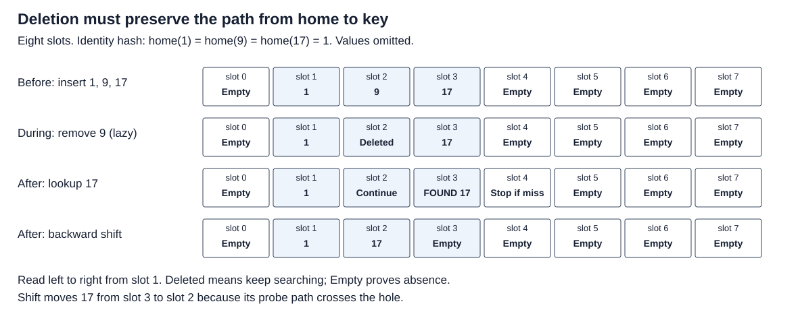

# Open-addressed hash tables

Preserve the probe path when deleting, growing, or traversing a map. Linear
probing starts at a home slot and advances through the slot array. An empty
slot proves absence; a deleted slot does not.



## Contract and candidates

`LinearMap` maps all `u64` keys and values, including zero and `u64::MAX`.
Insert returns the previous value; remove/get return an optional value.
Power-of-two capacity starts at eight. All probes are bounded by capacity.
Live occupancy above seven eighths triggers doubling; allocation failure or
capacity overflow panics. The implementation is single-threaded, safe Rust.

- `Lazy`: preserve tombstones until reuse or live-load growth. Simple baseline.
- `Rebuild`: before a new-key insert, clean at the same capacity when deleted
  slots exceed one eighth. The threshold is an experimental policy.
- `Shift`: scan forward and move only entries whose cyclic home-to-position
  path crosses the hole. This rule belongs to linear probing, not an arbitrary
  quadratic or double-hash sequence.

Insert checks for an existing key before reusing a tombstone. Otherwise deleting
9 in the 1/9/17 example and then updating17 can create two copies of17.
Never blindly move every following entry: an entry at its home stays there.

`iter` has no order guarantee and borrows the map, preventing overlapping
structural mutation in safe Rust. `visit_values` permits value edits;
`snapshot_keys` owns keys for later edits and relookup of current values.
It does not snapshot values or include newly inserted keys. No concurrent or
stable-slot/address guarantee is provided.

## Cost and growth

Let `m` be slots, `n` live entries, `d` deleted slots. Live load is `n/m`,
nonempty load is `(n+d)/m`; neither captures cluster shape. After deleting9
from eight slots, these are2/8=0.25 and3/8=0.375 with tombstones.

Let `h` be hash cost, `s` slot-inspection cost, `p` slots inspected.
Lookup cost is modeled as `h+p*s`: key17 needs `h+3s` after tombstone deletion
and `h+2s` after shift. These are explanatory counts, not fitted times.
For `dist(a,b)=(b-a) mod m`, move a key only when
`dist(home,hole)<dist(home,pos)`. Here `m=8`, home1/hole2/pos3 gives1<2.
Worst-case search and shift scan capacity. Rebuild scans the old slots and
initializes new storage, plus live reinsertion costs; concentrated hashes can
make reinsertion more expensive than linear. The fixed mixer provides no
random-independence or adversarial-security theorem.

`ExtendibleMap` demonstrates segmented growth using a directory and local
vector buckets. It uses low key bits, cap12 directory depth, then explicit
vector overflow; no bucket merge/shrink. It is not a performance candidate.
For global depth `g`, directory size is `2^g`; local depth `l` means
`2^(g-l)` aliases. Example1/9/17 with bucket limit2 reaches global4, sixteen
directory entries, five buckets,45 pointer visits and8 redistributed rows.
The simple implementation scans the directory to rewire every split.
Local redistribution does not remove directory, allocation, repeated-split,
overflow or iterator costs.

## Run

```bash
cargo test -p open-addressed-hash-tables
cargo run -p open-addressed-hash-tables --example probe
cargo bench -p open-addressed-hash-tables --bench probe -- churn_read shift
```

See BENCHMARK.md and measurements/README.md for exact Linux replay and selected
options. The correctness oracle is BTreeMap with independently implemented
operations. Exhaustive histories are bounded evidence, not a general proof.

## Coverage and revisit

Catalog coverage: linear probing; tombstones/deletion; extendible hashing and
segmented growth; mutation during iteration. All are taught and executable.
Revisit: optimized alias rewiring, merge/shrink, byte-sized bucket budgets,
mutation-tolerant live iterators, randomized/adversarial hash strategies,
maintenance tail latency, sparse iteration, and wider values. Swiss metadata,
Robin Hood distance balancing and cuckoo displacement keep their own topics.

## Primary sources

- Thorup, Linear Probing with Constant Independence (2015), deletion invariant:
  https://arxiv.org/abs/1509.04549
- Bender/Kuszmaul/Kuszmaul, Linear Probing Revisited (2021), tombstone-policy limits:
  https://arxiv.org/abs/2107.01250
- Go1.24 source, directory doubling and replacement (implementation-specific):
  https://github.com/golang/go/blob/go1.24.0/src/internal/runtime/maps/map.go
- Rust HashMap API, borrowing and current capacity-scanning iteration:
  https://doc.rust-lang.org/std/collections/struct.HashMap.html
