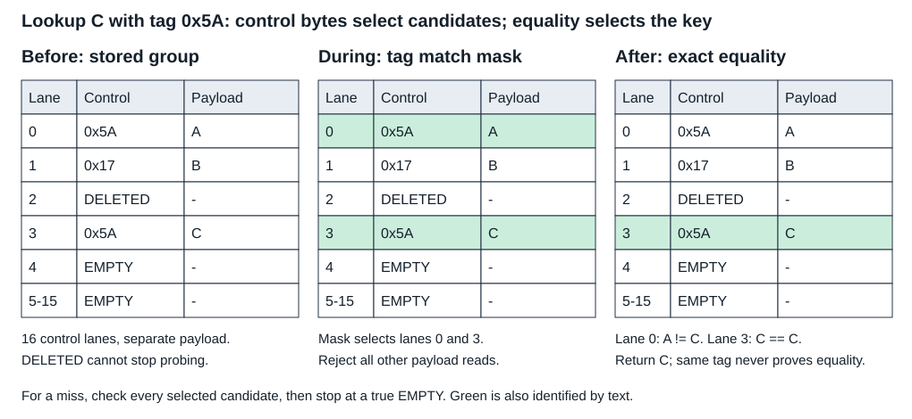

# SwissTable-style metadata filtering

Reject payloads by control tags, then compare exact keys. A tag match is a candidate;
DELETED preserves a probe path and true EMPTY may terminate only after group candidates.



The example queries C with tag0x5A. Lanes0 and3 match the tag; A fails equality and C succeeds.
The 5-15 row represents eleven lanes. The sixteen-lane owned teaching layout uses aligned
linear groups, fixed power-of-two capacity and separate arrays. Production hashbrown's
probe sequence and backend widths differ. This crate has no resize, tombstone cleanup,
reference escape or adversarial security hasher. Every key operation requires the same prehash.

## Candidates and contracts

- `Unfiltered`: compare every full lane. Simple baseline; many payload comparisons.
- `Scalar`: build a tag mask with scalar lane tests. Useful tags reject payloads.
- `Word`: exact sixteen-byte SWAR mask. Mask extraction has overhead; measure it.

All candidates use one layout and mutation protocol. Insert replaces duplicates, searches
past tombstones before reuse and returns `Err(value)` when full. Erase always leaves DELETED.
Lookup scans finitely even without EMPTY. The narrow comparison mode reads only the last
key word; both modes retain the same64-byte key layout. Wide keys share a56-byte prefix.

`matching_mask` uses little-endian lanes and a carry-isolated exact zero-lane formula.
Classic subtract-one masks can contain extra candidate bits. Conservative candidates can
be safe when initialized full slots are rechecked exactly; structural termination must
not accept false EMPTY states. [Pinned generic implementation](https://github.com/rust-lang/hashbrown/blob/d69025b4c2318e27d4b723b7350df34e70c49f64/src/control/group/generic.rs)

## Cost and selection

For k nonmatching occupied candidates and b conditionally useful tag bits,
expected accidental comparisons are k/2^b. Three independent seven-bit tags give3/128.
A hit also requires its true-key comparison. Constant or bucket-correlated tags invalidate
that filtering benefit. Metadata groups, payload comparisons and hashing have separate costs.
Control storage adds one byte per bucket: m*(P+1) array bytes for capacity m and P payload bytes.
Here P=72;32 buckets need2,336 array bytes, excluding headers/allocator rounding.

Use a maintained standard map for application defaults. See [measurements](measurements/README.md)
for scoped local selection and pending required Linux evidence. No measured result establishes
a universal optimum, production-map speedup, cache mechanism or cross-ISA comparison.

## Run

```sh
cargo run -p swisstable-metadata-filtering --example metadata
cargo test -p swisstable-metadata-filtering
cd topics/014-swisstable-metadata-filtering
python3 measurements/runner.py
python3 measurements/analyze.py raw
```

The runner requires a fresh `raw/` directory. It records identities, correctness, native
assembly and360 candidate processes. Keep raw evidence externally. Ordinary wide misses
should need fewer equalities with useful tags; constant-tag controls should not.

## Revisit scope

Production-compatible probing; timed conservative candidate masks; hashing-inclusive queries;
true cold/startup cases; rebuild/resize tails; other key/value layouts and mutation mixes.
Catalog Topic014 has no additional named coverage array.

## Primary sources

- [Abseil Swiss Tables design](https://abseil.io/about/design/swisstables): placement, tag filtering and exact equality.
- [Pinned hashbrown generic group](https://github.com/rust-lang/hashbrown/blob/d69025b4c2318e27d4b723b7350df34e70c49f64/src/control/group/generic.rs): conservative candidate and structural state masks.
- [Pinned hashbrown NEON group](https://github.com/rust-lang/hashbrown/blob/d69025b4c2318e27d4b723b7350df34e70c49f64/src/control/group/neon.rs): eight-byte target backend.
- [Rust HashMap](https://doc.rust-lang.org/std/collections/struct.HashMap.html): public contract and SwissTable-derived implementation description.
